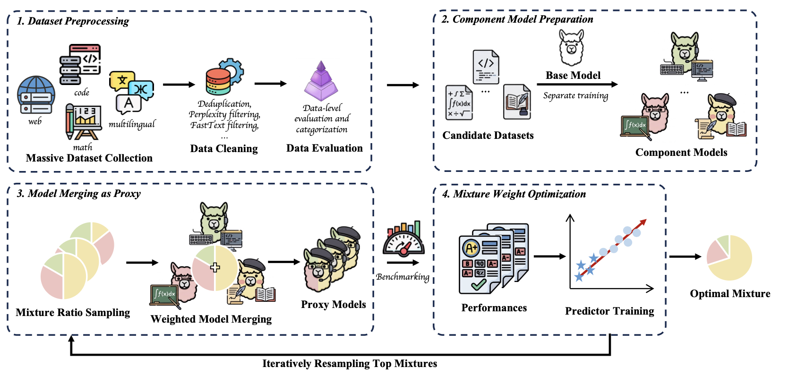

# DeMix

📄 **Paper:** [Decouple Searching from Training: Scaling Data Mixing via Model Merging for Large Language Model Pre-training](https://arxiv.org/abs/2602.00747)

🤗 **Dataset:** [DeMix Corpora](https://huggingface.co/datasets/lucius1022/DeMix_Corpora)

🐱 **Github:** [Demix](https://github.com/Lucius-lsr/DeMix)

---

## 📚 DeMix Corpora
Link: [https://huggingface.co/datasets/lucius1022/DeMix_Corpora](https://huggingface.co/datasets/lucius1022/DeMix_Corpora)

Pre-training data is coming soon.

## 🚀 Reproduce DeMix
We provide a quick guide to reproduce DeMix

### 1. 📥 Download all models
- Download all models from [DeMix Corpora](https://huggingface.co/datasets/lucius1022/DeMix_Corpora) (for reproduction; no need to prepare data or train from scratch).
  - `component_models` contains all 7 trained component models, with token budgets of 2B, 10B, 30B, and 50B.
  - `reference_models` contains 16 reference models from sampled mixtures.
  - `reference_models/sampled_mixture.json` contains the corresponding 16 mixtures of the 16 reference models.

### 2. ⚡ Merge proxies
- **Merge proxies**
  - In `model_merge/generate_merge_yaml.py`, replace all UPPER_CASE variables with appropriate values and run the script to generate the merge YAML file.
  - In `model_merge/merge_models.sh`, replace all UPPER_CASE variables with appropriate values and run the script to merge the component models.

### 3. 🧭 Evaluate with OpenCompass
- **Evaluate with OpenCompass**
  - Run `pip install opencompass` to install OpenCompass.
  - Use OpenCompass to evaluate the following benchmarks for both merged models and reference models:
    - General: ARC-E, HellaSwag, PIQA, SIQA, WinoGrande
    - Code: MBPP, HumanEval
    - Math: GSM8K, MATH
  - Either merged models or early checkpoints of reference models (trained as tiny proxies like RegMix/CLIMB) can be evaluated.

### 4. 📊 Calculate rank consistency
- **Calculate rank consistency**
  - In `eval_merged/proxy_eval.py`, extract the benchmark results via `get_benchmark_data()` and run the script.

---

## 🛠️ DeMix Pipeline

*(Please replace `assets/pipeline_diagram.png` with the actual path to your pipeline diagram)*

### 1. 📦 Prepare Candidate Dataset
- Prepare and preprocess the candidate datasets for mixing.

### 2. 🔥 Train Component Models
- Train a separate component model for each candidate dataset (or data source).

### 3. 🎲 Sample Mixtures
- Generate candidate data-mixture samples:
  - Run `iterative_sample/sample.py`

### 4. 🔗 Merge Component Models
- Generate the merge configuration YAML:
  - Run `model_merge/generate_merge_yaml.py`
- Merge component models:
  - Run `model_merge/merge_model.sh`

### 5. 🧐 Benchmark Merged Models
- Evaluate merged models using **OpenCompass** or other benchmarking utilities.

### 6. 🔄 Train Predictor & Iterate
- Train the predictor model:
  - Run `iterative_sample/train_predictor.py`
- Repeat from **Step 3** (Sample Mixtures) onward until convergence,
  and obtain the final optimal data mixture.

---

